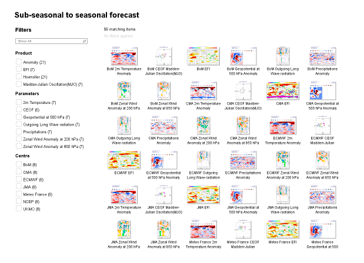

# static-charts
Full page web widget to display static charts from the European Centre for Medium Range Weather Forecasting (ECMWF)

An example can be seen at http://atmosphere.copernicus.eu/s/charts/s2s/

This repository contains a build of the application. The source files can be found in the [ECMWF repository](https://software.ecmwf.int/stash/projects/WEB/repos/node-modules/browse)

### setup

 * By default the widget will use the '#chart-browser' element. You can specify a different selector in ECMWF.options.dom.main
 * The widget will inspect the url to determine what to display. For example the url /somepath/charts/s2s/ which cause the 's2s' chart package to be displayed.
 * Ideally your webserver should serve the same page for all paths under, for example, /somepath/charts/. This is so that users can go directly to a specific chart rather than the chart listing.

### available chart packages:

* s2s "Sub-seasonal to seasonal forecast"
* c3s_seasonal "C3S seasonal charts"
